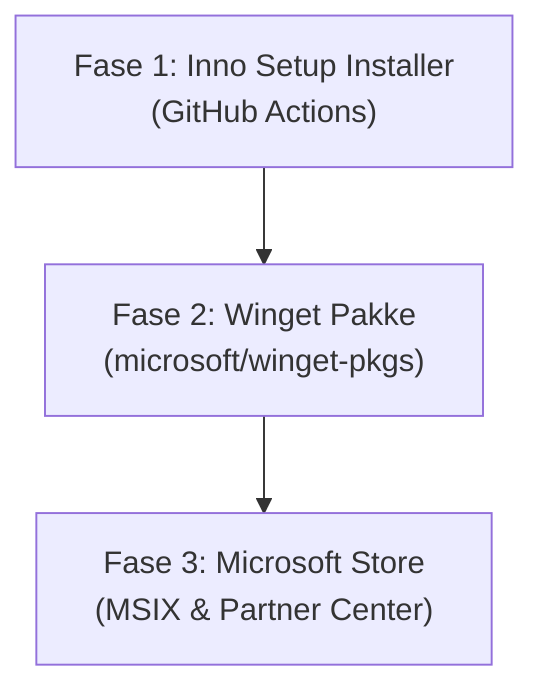

# Distributions- og Publiceringsplan for Win-ARM-Text-Expander

Dette dokument beskriver strategien, kravene og den trinvise køreplan for at distribuere og publicere **Win-ARM-Text-Expander** til Windows-brugere.

---

## 1. Oversigt & Teknisk Evaluering

| Distributionskanal | Formål / Målgruppe | Krav & Forudsætninger | Pris | Prioritet |
| :--- | :--- | :--- | :--- | :--- |
| **GitHub Release (Inno Setup)** | Klassisk setup-fil med Start Menu-genvej, autostart og pæn afinstallation. | Inno Setup script (`.iss`) i repo + integration i GitHub Actions. | Gratis | **Fase 1 (Højeste)** |
| **Winget (Windows Package Manager)** | Nem installation via CLI (`winget install rust-expander`) for tech-brugere. | GitHub Release download-URL'er + PR i `microsoft/winget-pkgs`. | Gratis | **Fase 2 (Høj)** |
| **Microsoft Store** | Grafisk butik, bred distribution, automatisk signering & opdatering uden SmartScreen-advarsler. | Microsoft Partner Center konto + MSIX-emballage + Store certifikat/godkendelse. | ~$19 engangsgebyr | **Fase 3 (Medium)** |

---

## 2. Arkitekturhåndtering: ARM64 vs. x86_64

Appen er designet til både native ARM64 (f.eks. Snapdragon X Elite/Plus) og traditionel 64-bit Intel/AMD (x86_64).

* **GitHub Releases:**
  * Bygger to setups: `Rust-Expander-Setup-arm64.exe` og `Rust-Expander-Setup-x64.exe`.
  * Bygger fortsat standalone portable zips for brugere, der foretrækker en transportabel udgave.
* **Winget:**
  * Winget understøtter multi-arkitektur i samme manifest. Winget detekterer automatisk klientens CPU-arkitektur og downloader den matchende native installer.
* **Microsoft Store:**
  * Flere MSIX-pakker (eller en `.msixbundle`) uploades under samme submission. Microsoft Store serverer automatisk den korrekte pakke til brugeren.

---

## 3. Trinvis Køreplan

---

### Fase 1: Inno Setup Installer & GitHub Actions

**Mål:** Give brugere en standard Windows-installationsoplevelse med afinstallation og autostart.

1. **Opret Inno Setup script (`installer/setup.iss`):**
   * Installation som "Per-User" (`{localappdata}\Programs\RustExpander`) uden krav om administrator-rettigheder (UAC prompt undgås).
   * Oprettelse af Start Menu-genvej.
   * Valgfri genvej på Skrivebordet.
   * Valgfri autostart ved Windows-login (`HKEY_CURRENT_USER\Software\Microsoft\Windows\CurrentVersion\Run`).
   * Registrering i Windows *Indstillinger > Apps > Installerede apps* for nem afinstallation.
2. **Opdater `.github/workflows/release.yml`:**
   * Kør `iscc` (Inno Setup Compiler) for både `arm64` og `x64` builds.
   * Upload `Rust-Expander-Setup-arm64.exe` og `Rust-Expander-Setup-x64.exe` til GitHub Releases sammen med SHA-256 kontrolsummer.

---

### Fase 2: Winget Distribution

**Mål:** Gøre det muligt at installere og opdatere appen via `winget install rust-expander`.

1. **Krav:**
   * **Kodesignering:** Ikke påkrævet for Winget (hashes og sandboxed scanning benyttes).
   * **Silent install flag:** Inno Setup understøtter standard `/VERYSILENT /NORESTART /ALLUSERS=0`.
2. **Oprettelse af manifest:**
   * Kør `wingetcreate new <URL-til-release-installer>` for at generere YAML-manifestet.
   * Specificer URLs for både `arm64` og `x64`.
   * Indsend Pull Request til [microsoft/winget-pkgs](https://github.com/microsoft/winget-pkgs).
3. **Automatisering (Valgfrit):**
   * Tilføj GitHub Action (`vedantmgoyal2009/winget-releaser` eller `winget-create`), der automatisk laver en PR til Winget-repoet ved nye releases.

---

### Fase 3: Microsoft Store (MSIX Distribution)

**Mål:** Maksimal troværdighed, 0 SmartScreen advarsler og automatisk opdatering i baggrunden.

1. **Forudsætninger:**
   * Opret en individuel udviklerkonto hos [Microsoft Partner Center](https://partner.microsoft.com/) ($19 engangsgebyr).
   * Forbered links til GitHub repository / privatlivspolitik (Privacy Policy) i README.
2. **MSIX Packaging:**
   * Opsæt MSIX packaging (f.eks. via Windows SDK `MakeAppx` eller `cargo-dist`).
   * Definer app manifest (`AppxManifest.xml`) med ikoner, app-navn og capabilities.
3. **Store Submission:**
   * Reserver app-navn i Partner Center.
   * Upload ARM64 og x64 MSIX-pakkerne.
   * Udfyld butiksside (beskrivelse, screenshots, kategorier: Productivity / Accessibility).
   * Send til certificering (tager typisk 24–48 timer).
